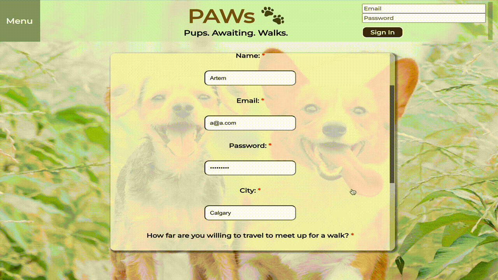

# Welcome to PAWs


### A full-stack social app that matches and links the dogs for walks and play-dates. Matches are made based on detailed dog profiles and geographical location.

--------------------------------------------------------------------------------
Creating a user profile:



--------------------------------------------------------------------------------
Main page:


--------------------------------------------------------------------------------
Create dog:


--------------------------------------------------------------------------------
My dog matches:


--------------------------------------------------------------------------------
My favourites:


--------------------------------------------------------------------------------
Chatting with a dog owner:


## Initial setup

1. After cloning the repo, inside ```express-server/``` folder
create a file ```.env.development``` and copy the contents of ```.env.example``` into it.
2. Fill in the contents: 
``` pghost - localhost ```
``` pguser - 'your pg user' ```
``` pgdatabase - paws ```
``` pgpassword - development ```
``` pgport - 5432 ```

## Database setup

1. In the 'express-server' folder type in ```psql```.
2. Create new database:
 ``` CREATE DATABASE paws; ```
3. Enter it with the command:
 ``` \c paws; ```
4. Add the dt schema: 
 ``` \i src/db/schema/01_schema.sql; ```
5. Populate dt with: 
 ``` \i src/db/seeds/01_seeds.sql; ```

To view the contents, run: 
``` SELECT * FROM owners; ```
``` SELECT * FROM dogs; ```

If need to reset dt, run: 
``` \i src/db/schema/01_schema.sql; ```

To delete dt and start over: 
``` psql ```
``` DROP DATABASE IF EXISTS paws; ```

## Start the Database Server

``` npm start ```

## After the server is running, browse data:
Dogs:
```localhost:8001/api/dogs```
Owners:
```localhost:8001/api/owners```

## Reset database

Paste ```localhost:8001/api/debug/reset``` in your browser while server is running
